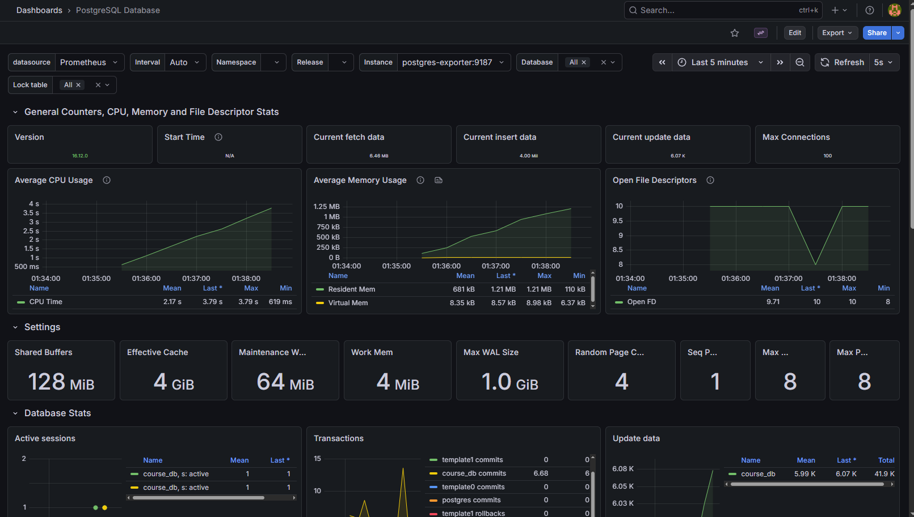
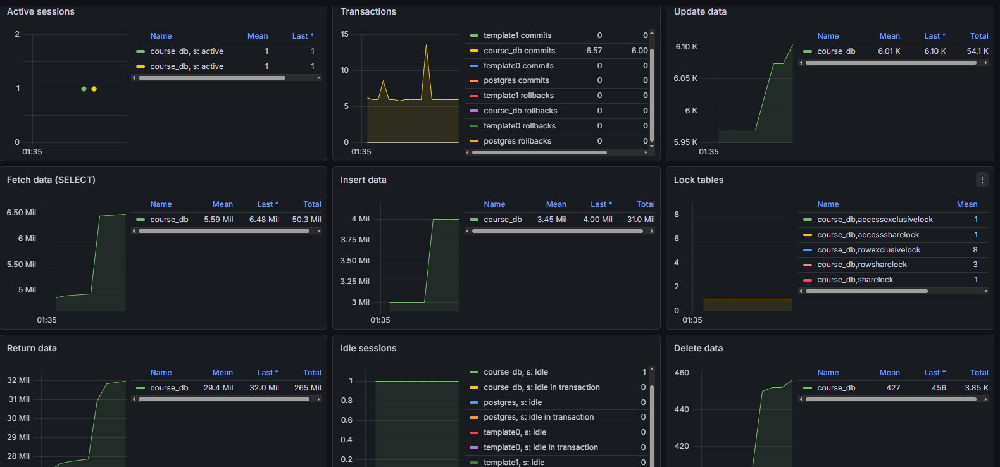

# GIN
## 1. User interests
```postgresql
CREATE INDEX idx_user_interests ON "user" USING GIN(interests);
EXPLAIN (ANALYZE, BUFFERS) SELECT * from "user" where interests @> ARRAY['cs', 'music'];
```
### Without Index
| QUERY PLAN |
| :--- |
| Seq Scan on "user"  \(cost=0.00..13780.00 rows=82692 width=519\) \(actual time=0.010..100.247 rows=83363 loops=1\) |
|   Filter: \(interests @&gt; '{cs,music}'::text\[\]\) |
|   Rows Removed by Filter: 166637 |
|   Buffers: shared hit=3976 read=6679 |
| Planning Time: 0.076 ms |
| Execution Time: 102.999 ms |

### With GIN Index
| QUERY PLAN |
| :--- |
| Bitmap Heap Scan on "user"  \(cost=629.06..12328.75 rows=83575 width=520\) \(actual time=10.503..35.121 rows=83363 loops=1\) |
|   Recheck Cond: \(interests @&gt; '{cs,music}'::text\[\]\) |
|   Heap Blocks: exact=10655 |
|   Buffers: shared hit=10732 |
|   -&gt;  Bitmap Index Scan on idx\_user\_interests  \(cost=0.00..608.17 rows=83575 width=0\) \(actual time=9.124..9.125 rows=83363 loops=1\) |
|         Index Cond: \(interests @&gt; '{cs,music}'::text\[\]\) |
|         Buffers: shared hit=77 |
| Planning: |
|   Buffers: shared hit=1 |
| Planning Time: 0.121 ms |
| Execution Time: 38.157 ms |

## 2. User bio FTS
```postgresql
EXPLAIN ANALYZE SELECT * FROM "user" WHERE to_tsvector('english', bio) @@ to_tsquery('english', 'database & network')
```
### Without GIN index
| QUERY PLAN |
| :--- |
| Gather  \(cost=1000.00..43062.35 rows=6 width=649\) \(actual time=1.611..2220.983 rows=62253 loops=1\) |
|   Workers Planned: 2 |
|   Workers Launched: 2 |
|   -&gt;  Parallel Seq Scan on "user"  \(cost=0.00..42061.75 rows=2 width=649\) \(actual time=0.696..2203.137 rows=20751 loops=3\) |
|         Filter: \(to\_tsvector\('english'::regconfig, bio\) @@ '''databas'' & ''network'''::tsquery\) |
|         Rows Removed by Filter: 62582 |
| Planning Time: 10.016 ms |
| Execution Time: 2224.524 ms |


### With GIN index
| QUERY PLAN |
| :--- |
| Gather  \(cost=1529.17..31710.35 rows=73854 width=649\) \(actual time=22.491..93.143 rows=62253 loops=1\) |
|   Workers Planned: 2 |
|   Workers Launched: 2 |
|   -&gt;  Parallel Bitmap Heap Scan on "user"  \(cost=529.17..23324.95 rows=30772 width=649\) \(actual time=18.271..79.300 rows=20751 loops=3\) |
|         Recheck Cond: \(to\_tsvector\('english'::regconfig, bio\) @@ '''databas'' & ''network'''::tsquery\) |
|         Heap Blocks: exact=5521 |
|         -&gt;  Bitmap Index Scan on idx\_user\_bio  \(cost=0.00..510.70 rows=73854 width=0\) \(actual time=19.482..19.483 rows=62253 loops=1\) |
|               Index Cond: \(to\_tsvector\('english'::regconfig, bio\) @@ '''databas'' & ''network'''::tsquery\) |
| Planning Time: 0.344 ms |
| Execution Time: 95.863 ms |


## 3. Lesson materials accessible to staff
```postgresql
CREATE INDEX idx_lesson_materials_gin ON lesson USING GIN (materials);
EXPLAIN ANALYZE SELECT * FROM lesson WHERE materials @> '{"access_level": "staff"}';
```
### Without GIN
| QUERY PLAN |
| :--- |
| Seq Scan on lesson  \(cost=0.00..15679.00 rows=62575 width=880\) \(actual time=0.016..112.168 rows=62703 loops=1\) |
|   Filter: \(materials @&gt; '{"access\_level": "staff"}'::jsonb\) |
|   Rows Removed by Filter: 187297 |
| Planning Time: 0.083 ms |
| Execution Time: 114.413 ms |


### With GIN
| QUERY PLAN |
| :--- |
| Bitmap Heap Scan on lesson  \(cost=567.42..13891.63 rows=61617 width=880\) \(actual time=13.452..63.996 rows=62703 loops=1\) |
|   Recheck Cond: \(materials @&gt; '{"access\_level": "staff"}'::jsonb\) |
|   Heap Blocks: exact=12504 |
|   -&gt;  Bitmap Index Scan on idx\_lesson\_materials  \(cost=0.00..552.01 rows=61617 width=0\) \(actual time=12.029..12.029 rows=62703 loops=1\) |
|         Index Cond: \(materials @&gt; '{"access\_level": "staff"}'::jsonb\) |
| Planning Time: 0.070 ms |
| Execution Time: 66.119 ms |


## 4. Lesson materials contains key resources
```postgresql
EXPLAIN ANALYZE SELECT * FROM lesson WHERE materials ? 'resources';
```
### Without GIN
| QUERY PLAN |
| :--- |
| Seq Scan on lesson  \(cost=0.00..12003.00 rows=24758 width=760\) \(actual time=0.015..81.731 rows=25246 loops=1\) |
|   Filter: \(materials ? 'resources'::text\) |
|   Rows Removed by Filter: 224754 |
| Planning Time: 0.077 ms |
| Execution Time: 82.802 ms |


### With GIN
| QUERY PLAN |
| :--- |
| Bitmap Heap Scan on lesson  \(cost=197.57..9388.17 rows=25008 width=760\) \(actual time=2.896..22.359 rows=25246 loops=1\) |
|   Recheck Cond: \(materials ? 'resources'::text\) |
|   Heap Blocks: exact=8480 |
|   -&gt;  Bitmap Index Scan on idx\_lesson\_materials  \(cost=0.00..191.32 rows=25008 width=0\) \(actual time=1.886..1.886 rows=25246 loops=1\) |
|         Index Cond: \(materials ? 'resources'::text\) |
| Planning Time: 0.074 ms |
| Execution Time: 23.178 ms |

## 5. Json array contains value
```postgresql
CREATE INDEX idx_enrollment_progress ON enrollment USING GIN(progress);
EXPLAIN ANALYZE SELECT * FROM enrollment WHERE progress @> '{"badges_earned": ["perfect_score"]}';
```
### Without GIN
| QUERY PLAN |
| :--- |
| Seq Scan on enrollment  \(cost=0.00..15566.00 rows=88384 width=389\) \(actual time=0.016..108.463 rows=83373 loops=1\) |
|   Filter: \(progress @&gt; '{"badges\_earned": \["perfect\_score"\]}'::jsonb\) |
|   Rows Removed by Filter: 166627 |
| Planning Time: 0.091 ms |
| Execution Time: 111.282 ms |


### With GIN
| QUERY PLAN |
| :--- |
| Bitmap Heap Scan on enrollment  \(cost=643.46..14220.82 rows=90909 width=389\) \(actual time=11.324..59.831 rows=83373 loops=1\) |
|   Recheck Cond: \(progress @&gt; '{"badges\_earned": \["perfect\_score"\]}'::jsonb\) |
|   Heap Blocks: exact=12439 |
|   -&gt;  Bitmap Index Scan on idx\_enrollment\_progress  \(cost=0.00..620.73 rows=90909 width=0\) \(actual time=9.794..9.795 rows=83373 loops=1\) |
|         Index Cond: \(progress @&gt; '{"badges\_earned": \["perfect\_score"\]}'::jsonb\) |
| Planning Time: 0.142 ms |
| Execution Time: 61.892 ms |


# GIST
## 1. Flow active time intersection
```postgresql
CREATE INDEX idx_flow_active_range ON flow USING GIST (active_range);
EXPLAIN (ANALYZE, BUFFERS) SELECT * FROM flow WHERE active_range && '[2026-06-15,2026-07-30]'::daterange;
```
### Without index
| QUERY PLAN |
| :--- |
| Seq Scan on flow  \(cost=0.00..15698.00 rows=22498 width=490\) \(actual time=0.022..96.616 rows=22388 loops=1\) |
|   Filter: \(active\_range && '\[2026-06-15,2026-07-31\)'::daterange\) |
|   Rows Removed by Filter: 227612 |
|   Buffers: shared hit=10719 read=1854 |
| Planning Time: 0.107 ms |
| Execution Time: 97.945 ms |


### With index
| QUERY PLAN |
| :--- |
| Bitmap Heap Scan on flow  \(cost=954.03..13857.42 rows=25000 width=491\) \(actual time=26.354..36.940 rows=22388 loops=1\) |
|   Recheck Cond: \(active\_range && '\[2026-06-15,2026-07-31\)'::daterange\) |
|   Heap Blocks: exact=10623 |
|   Buffers: shared hit=12448 |
|   -&gt;  Bitmap Index Scan on idx\_flow\_active\_range  \(cost=0.00..947.78 rows=25000 width=0\) \(actual time=25.108..25.110 rows=22388 loops=1\) |
|         Index Cond: \(active\_range && '\[2026-06-15,2026-07-31\)'::daterange\) |
|         Buffers: shared hit=1825 |
| Planning Time: 0.077 ms |
| Execution Time: 37.737 ms |

## 2. Пользователь активен в конкретный момент (User Active Period)
```postgresql
CREATE INDEX idx_user_active_period ON "user" USING GIST (active_period);
EXPLAIN (ANALYZE, BUFFERS) SELECT * FROM "user" WHERE active_period @> '2025-10-15 12:00:00+03'::timestamptz;
```

### Without index
| QUERY PLAN |
| :--- |
| Seq Scan on "user"  \(cost=0.00..23405.00 rows=40063 width=809\) \(actual time=0.052..86.775 rows=40100 loops=1\) |
|   Filter: \(active\_period @&gt; '2025-05-15 09:00:00+00'::timestamp with time zone\) |
|   Rows Removed by Filter: 209900 |
|   Buffers: shared hit=15937 read=4343 |
| Planning Time: 0.096 ms |
| Execution Time: 88.106 ms |


### With index
| QUERY PLAN |
| :--- |
| Bitmap Heap Scan on "user"  \(cost=1911.72..22700.48 rows=40701 width=811\) \(actual time=29.951..111.807 rows=40100 loops=1\) |
|   Recheck Cond: \(active\_period @&gt; '2025-05-15 09:00:00+00'::timestamp with time zone\) |
|   Heap Blocks: exact=17934 |
|   Buffers: shared hit=1300 read=19079 |
|   -&gt;  Bitmap Index Scan on idx\_user\_active\_period  \(cost=0.00..1901.54 rows=40701 width=0\) \(actual time=26.870..26.871 rows=40100 loops=1\) |
|         Index Cond: \(active\_period @&gt; '2025-05-15 09:00:00+00'::timestamp with time zone\) |
|         Buffers: shared hit=1300 read=1145 |
| Planning Time: 0.079 ms |
| Execution Time: 113.380 ms |

## 3. Ближайшие пользователи по геолокации
```postgresql
CREATE INDEX idx_user_location ON "user" USING GIST (home_location);
EXPLAIN (ANALYZE, BUFFERS) SELECT * FROM "user" ORDER BY home_location <-> point '(55.75, 37.61)' LIMIT 5;
```
### Without index
| QUERY PLAN |
| :--- |
| Limit  \(cost=24833.12..24834.29 rows=10 width=817\) \(actual time=110.976..116.057 rows=10 loops=1\) |
|   Buffers: shared hit=16232 read=4122 written=4 |
|   -&gt;  Gather Merge  \(cost=24833.12..49140.45 rows=208334 width=817\) \(actual time=110.973..116.052 rows=10 loops=1\) |
|         Workers Planned: 2 |
|         Workers Launched: 2 |
|         Buffers: shared hit=16232 read=4122 written=4 |
|         -&gt;  Sort  \(cost=23833.10..24093.51 rows=104167 width=817\) \(actual time=106.223..106.226 rows=8 loops=3\) |
|               Sort Key: \(\(home\_location &lt;-&gt; '\(55.75,37.61\)'::point\)\) |
|               Sort Method: top-N heapsort  Memory: 43kB |
|               Buffers: shared hit=16232 read=4122 written=4 |
|               Worker 0:  Sort Method: top-N heapsort  Memory: 41kB |
|               Worker 1:  Sort Method: top-N heapsort  Memory: 41kB |
|               -&gt;  Parallel Seq Scan on "user"  \(cost=0.00..21582.08 rows=104167 width=817\) \(actual time=0.046..53.119 rows=83333 loops=3\) |
|                     Buffers: shared hit=16158 read=4122 written=4 |
| Planning Time: 0.143 ms |
| Execution Time: 116.087 ms |

### With index
| QUERY PLAN |
| :--- |
| Limit  \(cost=0.28..4.05 rows=10 width=816\) \(actual time=0.070..0.129 rows=10 loops=1\) |
|   Buffers: shared hit=15 |
|   -&gt;  Index Scan using idx\_user\_location on "user"  \(cost=0.28..94240.28 rows=250000 width=816\) \(actual time=0.069..0.127 rows=10 loops=1\) |
|         Order By: \(home\_location &lt;-&gt; '\(55.75,37.61\)'::point\) |
|         Buffers: shared hit=15 |
| Planning Time: 0.128 ms |
| Execution Time: 0.157 ms |

## 4. Пользователи в радиусе
```postgresql
EXPLAIN (ANALYZE, BUFFERS) SELECT * FROM "user" WHERE home_location <@ circle '((55.75, 37.61), 10)';
```
### Without index
| QUERY PLAN |
| :--- |
| Gather  \(cost=1000.00..22607.08 rows=250 width=811\) \(actual time=0.315..44.068 rows=7863 loops=1\) |
|   Workers Planned: 2 |
|   Workers Launched: 2 |
|   Buffers: shared hit=15767 read=4513 |
|   -&gt;  Parallel Seq Scan on "user"  \(cost=0.00..21582.08 rows=104 width=811\) \(actual time=0.055..34.612 rows=2621 loops=3\) |
|         Filter: \(home\_location &lt;@ '&lt;\(55.75,37.61\),10&gt;'::circle\) |
|         Rows Removed by Filter: 80712 |
|         Buffers: shared hit=15767 read=4513 |
| Planning: |
|   Buffers: shared hit=58 |
| Planning Time: 0.222 ms |
| Execution Time: 44.517 ms |

### With index
| QUERY PLAN |
| :--- |
| Bitmap Heap Scan on "user"  \(cost=14.22..930.57 rows=250 width=810\) \(actual time=2.332..8.158 rows=7863 loops=1\) |
|   Recheck Cond: \(home\_location &lt;@ '&lt;\(55.75,37.61\),10&gt;'::circle\) |
|   Heap Blocks: exact=6574 |
|   Buffers: shared hit=6677 |
|   -&gt;  Bitmap Index Scan on idx\_user\_location  \(cost=0.00..14.16 rows=250 width=0\) \(actual time=1.477..1.478 rows=7863 loops=1\) |
|         Index Cond: \(home\_location &lt;@ '&lt;\(55.75,37.61\),10&gt;'::circle\) |
|         Buffers: shared hit=103 |
| Planning Time: 0.085 ms |
| Execution Time: 8.530 ms |

## 5. Диапазон посещаемости содержит значение
```postgresql
CREATE INDEX idx_enrollment_attendance_range ON enrollment USING GIST (attendance_range);
EXPLAIN (ANALYZE, BUFFERS) SELECT * FROM enrollment WHERE attendance_range @> 95.0;
```
### Without index
| QUERY PLAN |
| :--- |
| Seq Scan on enrollment  \(cost=0.00..14999.00 rows=24532 width=373\) \(actual time=0.022..98.137 rows=24949 loops=1\) |
|   Filter: \(attendance\_range @&gt; 95.0\) |
|   Rows Removed by Filter: 225051 |
|   Buffers: shared hit=10588 read=1286 |
| Planning Time: 0.164 ms |
| Execution Time: 99.376 ms |

### With index
| QUERY PLAN |
| :--- |
| Bitmap Heap Scan on enrollment  \(cost=1407.62..13590.23 rows=24689 width=373\) \(actual time=26.188..36.003 rows=24949 loops=1\) |
|   Recheck Cond: \(attendance\_range @&gt; 95.0\) |
|   Heap Blocks: exact=10537 |
|   Buffers: shared hit=12345 |
|   -&gt;  Bitmap Index Scan on idx\_enrollment\_attendance\_range  \(cost=0.00..1401.45 rows=24689 width=0\) \(actual time=24.903..24.903 rows=24949 loops=1\) |
|         Index Cond: \(attendance\_range @&gt; 95.0\) |
|         Buffers: shared hit=1808 |
| Planning Time: 0.079 ms |
| Execution Time: 36.765 ms |

# JOIN
## 1. Список студентов конкретного потока с их оценками
```postgresql
EXPLAIN (ANALYZE, BUFFERS)
SELECT u.full_name,
       u.email,
       e.current_score,
       e.final_grade,
       e.status AS enrollment_status
FROM enrollment e
         JOIN "user" u ON e.user_id = u.id
         JOIN flow f ON e.flow_id = f.id
WHERE f.code = 'FL1';
```
| QUERY PLAN |
| :--- |
| Nested Loop  \(cost=1.26..5742.42 rows=1 width=64\) \(actual time=4.791..4.793 rows=0 loops=1\) |
|   Buffers: shared hit=964 |
|   -&gt;  Nested Loop  \(cost=0.84..5741.65 rows=1 width=46\) \(actual time=4.790..4.791 rows=0 loops=1\) |
|         Buffers: shared hit=964 |
|         -&gt;  Index Scan using flow\_code\_key on flow f  \(cost=0.42..8.44 rows=1 width=8\) \(actual time=0.027..0.030 rows=1 loops=1\) |
|               Index Cond: \(\(code\)::text = 'FL1'::text\) |
|               Buffers: shared hit=4 |
|         -&gt;  Index Scan using enrollment\_user\_id\_flow\_id\_key on enrollment e  \(cost=0.42..5733.19 rows=2 width=54\) \(actual time=4.754..4.754 rows=0 loops=1\) |
|               Index Cond: \(flow\_id = f.id\) |
|               Buffers: shared hit=960 |
|   -&gt;  Index Scan using user\_pkey on "user" u  \(cost=0.42..0.77 rows=1 width=34\) \(never executed\) |
|         Index Cond: \(id = e.user\_id\) |
| Planning: |
|   Buffers: shared hit=24 |
| Planning Time: 0.543 ms |
| Execution Time: 4.865 ms |

## 2. Студенты, пропустившие более 50% занятий, но имеющие высокий балл
```postgresql
EXPLAIN (ANALYZE, BUFFERS)
SELECT
    u.full_name,
    f.title AS flow_name,
    e.attendance_pct,
    e.current_score
FROM enrollment e
JOIN "user" u ON e.user_id = u.id
JOIN flow f ON e.flow_id = f.id
WHERE e.attendance_pct < 50.0
  AND e.current_score > 85.0
  AND e.status = 'active';
```
| QUERY PLAN |
| :--- |
| Gather  \(cost=1000.84..37286.82 rows=6258 width=30\) \(actual time=0.343..75.857 rows=6209 loops=1\) |
|   Workers Planned: 2 |
|   Workers Launched: 2 |
|   Buffers: shared hit=47014 read=14536 |
|   -&gt;  Nested Loop  \(cost=0.84..35661.02 rows=2608 width=30\) \(actual time=0.122..66.076 rows=2070 loops=3\) |
|         Buffers: shared hit=47014 read=14536 |
|         -&gt;  Nested Loop  \(cost=0.42..25021.54 rows=2608 width=27\) \(actual time=0.087..48.495 rows=2070 loops=3\) |
|               Buffers: shared hit=25417 read=11295 |
|               -&gt;  Parallel Seq Scan on enrollment e  \(cost=0.00..13696.92 rows=2608 width=28\) \(actual time=0.044..33.142 rows=2070 loops=3\) |
|                     Filter: \(\(attendance\_pct &lt; 50.0\) AND \(current\_score &gt; 85.0\) AND \(\(status\)::text = 'active'::text\)\) |
|                     Rows Removed by Filter: 81264 |
|                     Buffers: shared hit=4467 read=7407 |
|               -&gt;  Index Scan using user\_pkey on "user" u  \(cost=0.42..4.34 rows=1 width=15\) \(actual time=0.007..0.007 rows=1 loops=6209\) |
|                     Index Cond: \(id = e.user\_id\) |
|                     Buffers: shared hit=20950 read=3888 |
|         -&gt;  Index Scan using flow\_pkey on flow f  \(cost=0.42..4.08 rows=1 width=19\) \(actual time=0.008..0.008 rows=1 loops=6209\) |
|               Index Cond: \(id = e.flow\_id\) |
|               Buffers: shared hit=21597 read=3241 |
| Planning: |
|   Buffers: shared hit=23 read=1 |
| Planning Time: 0.412 ms |
| Execution Time: 76.429 ms |

## 3. Детализация материалов урока для зачисленных студентов
```postgresql
EXPLAIN (ANALYZE, BUFFERS)
SELECT
    u.full_name,
    l.topic,
    l.materials->>'access_level' AS access_level,
    l.materials->'resources' AS resources_list
FROM enrollment e
JOIN "user" u ON e.user_id = u.id
JOIN flow f ON e.flow_id = f.id
JOIN lesson l ON l.flow_id = f.id
WHERE e.status = 'active'
  AND l.materials IS NOT NULL
LIMIT 20;
```
| QUERY PLAN |
| :--- |
| Limit  \(cost=1.27..12013.06 rows=20 width=83\) \(actual time=1.539..192.611 rows=20 loops=1\) |
|   Buffers: shared hit=58292 |
|   -&gt;  Nested Loop  \(cost=1.27..49848917.03 rows=83000 width=83\) \(actual time=1.538..192.601 rows=20 loops=1\) |
|         Buffers: shared hit=58292 |
|         -&gt;  Nested Loop  \(cost=0.85..49728321.53 rows=83000 width=94\) \(actual time=1.527..192.434 rows=20 loops=1\) |
|               Join Filter: \(e.flow\_id = f.id\) |
|               Buffers: shared hit=58212 |
|               -&gt;  Nested Loop  \(cost=0.43..49654662.43 rows=159784 width=110\) \(actual time=1.511..192.258 rows=20 loops=1\) |
|                     Buffers: shared hit=58151 |
|                     -&gt;  Seq Scan on lesson l  \(cost=0.00..11399.00 rows=250000 width=94\) \(actual time=0.013..0.161 rows=61 loops=1\) |
|                           Filter: \(materials IS NOT NULL\) |
|                           Buffers: shared hit=3 |
|                     -&gt;  Memoize  \(cost=0.43..1875.66 rows=1 width=16\) \(actual time=2.624..3.146 rows=0 loops=61\) |
|                           Cache Key: l.flow\_id |
|                           Cache Mode: logical |
|                           Hits: 0  Misses: 61  Evictions: 0  Overflows: 0  Memory Usage: 6kB |
|                           Buffers: shared hit=58148 |
|                           -&gt;  Index Scan using enrollment\_user\_id\_flow\_id\_key on enrollment e  \(cost=0.42..1875.65 rows=1 width=16\) \(actual time=2.620..3.142 rows=0 loops=61\) |
|                                 Index Cond: \(flow\_id = l.flow\_id\) |
|                                 Filter: \(\(status\)::text = 'active'::text\) |
|                                 Rows Removed by Filter: 1 |
|                                 Buffers: shared hit=58148 |
|               -&gt;  Index Only Scan using flow\_pkey on flow f  \(cost=0.42..0.45 rows=1 width=8\) \(actual time=0.006..0.006 rows=1 loops=20\) |
|                     Index Cond: \(id = l.flow\_id\) |
|                     Heap Fetches: 0 |
|                     Buffers: shared hit=61 |
|         -&gt;  Index Scan using user\_pkey on "user" u  \(cost=0.42..1.45 rows=1 width=15\) \(actual time=0.005..0.005 rows=1 loops=20\) |
|               Index Cond: \(id = e.user\_id\) |
|               Buffers: shared hit=80 |
| Planning: |
|   Buffers: shared hit=32 |
| Planning Time: 0.656 ms |
| Execution Time: 192.695 ms |

## 4. Студенты, не посетившие ни одного занятия (посещаемость 0 или NULL)
```postgresql
EXPLAIN (ANALYZE, BUFFERS)
SELECT
    f.title AS flow_title,
    u.full_name,
    u.email,
    COALESCE(e.attendance_pct, 0) AS attendance
FROM flow f
JOIN enrollment e ON e.flow_id = f.id
JOIN "user" u ON e.user_id = u.id
LEFT JOIN lesson l ON l.flow_id = f.id
    -- Попытка найти хотя бы одно посещение (логика зависит от того, как считается attendance_pct)
WHERE (e.attendance_pct IS NULL OR e.attendance_pct = 0)
  AND f.status = 'active';
```
| QUERY PLAN |
| :--- |
| Nested Loop  \(cost=317.44..12721.10 rows=8 width=69\) \(actual time=159.393..191.711 rows=9 loops=1\) |
|   Buffers: shared hit=177 read=8864 |
|   -&gt;  Hash Right Join  \(cost=317.02..12653.60 rows=8 width=25\) \(actual time=159.373..191.639 rows=9 loops=1\) |
|         Hash Cond: \(l.flow\_id = f.id\) |
|         Buffers: shared hit=141 read=8864 |
|         -&gt;  Seq Scan on lesson l  \(cost=0.00..11399.00 rows=250000 width=8\) \(actual time=0.005..172.275 rows=250000 loops=1\) |
|               Buffers: shared hit=35 read=8864 |
|         -&gt;  Hash  \(cost=316.92..316.92 rows=8 width=33\) \(actual time=0.124..0.127 rows=9 loops=1\) |
|               Buckets: 1024  Batches: 1  Memory Usage: 9kB |
|               Buffers: shared hit=106 |
|               -&gt;  Nested Loop  \(cost=9.47..316.92 rows=8 width=33\) \(actual time=0.025..0.122 rows=9 loops=1\) |
|                     Buffers: shared hit=106 |
|                     -&gt;  Bitmap Heap Scan on enrollment e  \(cost=9.05..105.92 rows=25 width=22\) \(actual time=0.016..0.036 rows=20 loops=1\) |
|                           Recheck Cond: \(\(attendance\_pct IS NULL\) OR \(attendance\_pct = '0'::numeric\)\) |
|                           Heap Blocks: exact=20 |
|                           Buffers: shared hit=26 |
|                           -&gt;  BitmapOr  \(cost=9.05..9.05 rows=25 width=0\) \(actual time=0.012..0.013 rows=0 loops=1\) |
|                                 Buffers: shared hit=6 |
|                                 -&gt;  Bitmap Index Scan on idx\_enrollment\_attendance  \(cost=0.00..4.43 rows=1 width=0\) \(actual time=0.005..0.005 rows=0 loops=1\) |
|                                       Index Cond: \(attendance\_pct IS NULL\) |
|                                       Buffers: shared hit=3 |
|                                 -&gt;  Bitmap Index Scan on idx\_enrollment\_attendance  \(cost=0.00..4.61 rows=25 width=0\) \(actual time=0.007..0.007 rows=20 loops=1\) |
|                                       Index Cond: \(attendance\_pct = '0'::numeric\) |
|                                       Buffers: shared hit=3 |
|                     -&gt;  Index Scan using flow\_pkey on flow f  \(cost=0.42..8.44 rows=1 width=19\) \(actual time=0.004..0.004 rows=0 loops=20\) |
|                           Index Cond: \(id = e.flow\_id\) |
|                           Filter: \(\(status\)::text = 'active'::text\) |
|                           Rows Removed by Filter: 1 |
|                           Buffers: shared hit=80 |
|   -&gt;  Index Scan using user\_pkey on "user" u  \(cost=0.42..8.44 rows=1 width=34\) \(actual time=0.006..0.006 rows=1 loops=9\) |
|         Index Cond: \(id = e.user\_id\) |
|         Buffers: shared hit=36 |
| Planning: |
|   Buffers: shared hit=32 |
| Planning Time: 0.532 ms |
| Execution Time: 191.752 ms |

## 4. Отчет по прогрессу студентов
```postgresql
EXPLAIN (ANALYZE, BUFFERS)
SELECT
    u.full_name,
    f.title,
    e.progress->>'current_module' AS current_module
FROM enrollment e
JOIN "user" u ON e.user_id = u.id
JOIN flow f ON e.flow_id = f.id
WHERE e.progress ? 'badges_earned'
  AND f.cohort_year = 2023;
```
| QUERY PLAN |
| :--- |
| Gather  \(cost=14124.99..38186.10 rows=25080 width=50\) \(actual time=64.649..186.324 rows=24783 loops=1\) |
|   Workers Planned: 2 |
|   Workers Launched: 2 |
|   Buffers: shared hit=86040 read=36122 |
|   -&gt;  Nested Loop  \(cost=13124.99..34678.10 rows=10450 width=50\) \(actual time=55.251..170.917 rows=8261 loops=3\) |
|         Buffers: shared hit=86040 read=36122 |
|         -&gt;  Parallel Hash Join  \(cost=13124.57..26574.06 rows=10450 width=253\) \(actual time=55.068..120.579 rows=8261 loops=3\) |
|               Hash Cond: \(e.flow\_id = f.id\) |
|               Buffers: shared hit=87 read=22941 |
|               -&gt;  Parallel Seq Scan on enrollment e  \(cost=0.00..13176.08 rows=104156 width=250\) \(actual time=0.069..40.389 rows=83333 loops=3\) |
|                     Filter: \(progress ? 'badges\_earned'::text\) |
|                     Buffers: shared read=11874 |
|               -&gt;  Parallel Hash  \(cost=12993.93..12993.93 rows=10451 width=19\) \(actual time=52.727..52.727 rows=8310 loops=3\) |
|                     Buckets: 32768  Batches: 1  Memory Usage: 1664kB |
|                     Buffers: shared read=11058 |
|                     -&gt;  Parallel Bitmap Heap Scan on flow f  \(cost=282.81..12993.93 rows=10451 width=19\) \(actual time=2.366..48.249 rows=8310 loops=3\) |
|                           Recheck Cond: \(cohort\_year = 2023\) |
|                           Heap Blocks: exact=5054 |
|                           Buffers: shared read=11058 |
|                           -&gt;  Bitmap Index Scan on idx\_flow\_cohort\_year  \(cost=0.00..276.54 rows=25083 width=0\) \(actual time=4.498..4.498 rows=24929 loops=1\) |
|                                 Index Cond: \(cohort\_year = 2023\) |
|                                 Buffers: shared read=23 |
|         -&gt;  Index Scan using user\_pkey on "user" u  \(cost=0.42..0.77 rows=1 width=15\) \(actual time=0.005..0.005 rows=1 loops=24783\) |
|               Index Cond: \(id = e.user\_id\) |
|               Buffers: shared hit=85953 read=13181 |
| Planning: |
|   Buffers: shared hit=16 read=9 |
| Planning Time: 3.698 ms |
| Execution Time: 187.775 ms |

## 5. Полный профиль студента: потоки, последние логины и ближайшие уроки
```postgresql
EXPLAIN (ANALYZE, BUFFERS)
SELECT 
    u.full_name,
    u.last_login_at,
    f.title AS flow_name,
    e.status AS enrollment_status,
    MIN(l.start_at) AS next_lesson_time,
    MIN(l.topic) AS next_lesson_topic
FROM "user" u
JOIN enrollment e ON u.id = e.user_id
JOIN flow f ON e.flow_id = f.id
JOIN lesson l ON l.flow_id = f.id
WHERE u.id = 54321
  AND e.status = 'active'
  AND l.start_at > NOW()
GROUP BY u.full_name, u.last_login_at, f.title, e.status;
```
| QUERY PLAN |
| :--- |
| GroupAggregate  \(cost=11486.92..11487.06 rows=1 width=74\) \(actual time=231.348..234.056 rows=0 loops=1\) |
|   Group Key: u.full\_name, u.last\_login\_at, f.title |
|   Buffers: shared hit=31 read=8900 |
|   -&gt;  Gather Merge  \(cost=11486.92..11487.04 rows=1 width=54\) \(actual time=231.347..234.054 rows=0 loops=1\) |
|         Workers Planned: 2 |
|         Workers Launched: 2 |
|         Buffers: shared hit=31 read=8900 |
|         -&gt;  Sort  \(cost=10486.90..10486.90 rows=1 width=54\) \(actual time=213.469..213.472 rows=0 loops=3\) |
|               Sort Key: u.full\_name, u.last\_login\_at, f.title |
|               Sort Method: quicksort  Memory: 25kB |
|               Buffers: shared hit=31 read=8900 |
|               Worker 0:  Sort Method: quicksort  Memory: 25kB |
|               Worker 1:  Sort Method: quicksort  Memory: 25kB |
|               -&gt;  Hash Join  \(cost=25.34..10486.89 rows=1 width=54\) \(actual time=213.130..213.132 rows=0 loops=3\) |
|                     Hash Cond: \(l.flow\_id = e.flow\_id\) |
|                     Buffers: shared read=8899 |
|                     -&gt;  Parallel Seq Scan on lesson l  \(cost=0.00..10461.50 rows=10 width=28\) \(actual time=213.129..213.129 rows=0 loops=3\) |
|                           Filter: \(start\_at &gt; now\(\)\) |
|                           Rows Removed by Filter: 83333 |
|                           Buffers: shared read=8899 |
|                     -&gt;  Hash  \(cost=25.33..25.33 rows=1 width=50\) \(never executed\) |
|                           -&gt;  Nested Loop  \(cost=1.26..25.33 rows=1 width=50\) \(never executed\) |
|                                 -&gt;  Nested Loop  \(cost=0.84..16.89 rows=1 width=31\) \(never executed\) |
|                                       -&gt;  Index Scan using enrollment\_user\_id\_flow\_id\_key on enrollment e  \(cost=0.42..8.44 rows=1 width=24\) \(never executed\) |
|                                             Index Cond: \(user\_id = 54321\) |
|                                             Filter: \(\(status\)::text = 'active'::text\) |
|                                       -&gt;  Index Scan using user\_pkey on "user" u  \(cost=0.42..8.44 rows=1 width=23\) \(never executed\) |
|                                             Index Cond: \(id = 54321\) |
|                                 -&gt;  Index Scan using flow\_pkey on flow f  \(cost=0.42..8.44 rows=1 width=19\) \(never executed\) |
|                                       Index Cond: \(id = e.flow\_id\) |
| Planning: |
|   Buffers: shared hit=29 read=19 |
| Planning Time: 5.470 ms |
| Execution Time: 234.140 ms |

# Grafana


