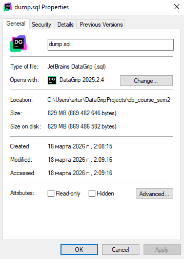

# 2a. LSN до/после INSERT
### До INSERT
```postgresql
SELECT pg_current_wal_lsn();
```
| pg\_current\_wal\_lsn |
| :--- |
| 5/141CC1A0 |
### После
```postgresql
INSERT INTO role (code, name, status)
VALUES ('student', 'Student', 'ACTIVE');
SELECT pg_wal_lsn_diff(
    pg_current_wal_lsn(),
    '5/141CC1A0'
);
```
| pg\_current\_wal\_lsn |
| :--- |
| 5/141CC410 |

| pg\_wal\_lsn\_diff |
| :--- |
| 624 |

# 2b. WAL до/после COMMIT
```postgresql
BEGIN;

SELECT pg_current_wal_lsn();

INSERT INTO role (code, name, status)
VALUES ('teacher', 'Teacher', 'ACTIVE');

SELECT pg_current_wal_lsn();

COMMIT;

SELECT pg_current_wal_lsn();
```
| before\_insert |
| :--- |
| 5/141CC6A8 |

| after\_insert |
| :--- |
| 5/141CC6A8 |

| after\_commit |
| :--- |
| 5/141CC8E0 |

```postgresql
SELECT pg_wal_lsn_diff(
               '5/141CC8E0',
               '5/141CC6A8'
       );
```
| pg\_wal\_lsn\_diff |
| :--- |
| 568 |

# 2c. Массовая вставка
```postgresql
SELECT pg_current_wal_lsn() as before_mass_insert;

INSERT INTO "user" (full_name, email, status)
SELECT
    'User ' || i,
    'user' || i || '@test2.com',
    'ACTIVE'
FROM generate_series(1, 10000) i;

SELECT pg_current_wal_lsn() as after_mass_insert;
```
| before\_mass\_insert |
| :--- |
| 5/166C1968 |

| after\_mass\_insert |
| :--- |
| 5/17E8F4E0 |

```postgresql
SELECT pg_wal_lsn_diff('5/17E8F4E0', '5/166C1968');
```
| pg\_wal\_lsn\_diff |
| :--- |
| 24959864 |

# 3. Сделать дамп БД и накатить его на новую чистую БД
```shell
PS C:\Users\artur\DataGripProjects\db_course_sem2> docker exec -it pg_course psql -U admin -d course_db -c "CREATE DATABASE test_db;"
CREATE DATABASE
PS C:\Users\artur\DataGripProjects\db_course_sem2> cat dump.sql | docker exec -i pg_course psql -U admin test_db

PS C:\Users\artur\DataGripProjects\db_course_sem2> docker exec -it pg_course psql -U admin -d test_db
psql (16.12 (Debian 16.12-1.pgdg13+1))
Type "help" for help.

test_db=# SELECT COUNT(*) FROM role;
SELECT COUNT(*) FROM "user";
SELECT COUNT(*) FROM flow;
 count 
-------
     2
(1 row)

 count  
--------
 270000
(1 row)

 count  
--------
 250000
(1 row)
```


# 3a. Дамп только структуры
```shell
docker exec -t pg_course pg_dump -U admin -s course_db > schema.sql
```

# 3.b Dump одной таблицы
```shell
docker exec -t pg_course pg_dump -U admin -t role course_db > role.sql
```

# 4. Создать несколько seed
### `db/seeds/001_roles.sql`:
```postgresql
INSERT INTO role (code, name, status)
VALUES ('admin', 'Administrator', 'ACTIVE'),
       ('student', 'Student', 'ACTIVE'),
       ('teacher', 'Teacher', 'ACTIVE')
ON CONFLICT (code)
    DO UPDATE SET name   = EXCLUDED.name,
                  status = EXCLUDED.status;
```
### `db/seeds/002_exam_statuses.sql`:
```postgresql
INSERT INTO exam_status (name)
VALUES ('SCHEDULED'),
       ('DONE'),
       ('CANCELLED')
ON CONFLICT (name) DO NOTHING;
```